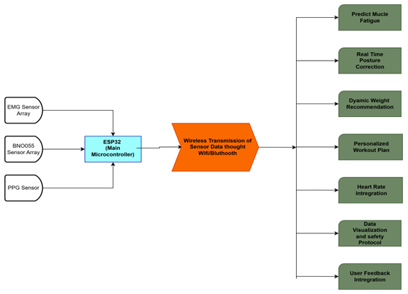

# AI-Powered-Wearable-System-for-Real-time-Fitness-Assistance-and-Injury-Prevention

## Problem Statement
Without expert supervision, individual trainees lack real-time, objective feedback on exercise form, muscle fatigue, and work output. This absence of guidance significantly increases the risk of injury (particularly in compound movements) and leads to suboptimal training outcomes. Current market solutions fail to holistically address the complex interplay between biomechanics, muscular failure, and cardiovascular stress in real-time.

## Hardware Overview
The physical system is built around an ESP32-WROOM-C6 microcontroller that aggregates data from a multi-sensor bio-kinematic array. The sensor suite includes five BNO055 IMUs (connected via a TCA9548A multiplexer) for skeletal tracking, two EMG sensors for analyzing bicep muscle activation, and a PPG sensor for heart rate monitoring. To ensure signal integrity, the device employs a dual-battery power architecture: one isolated rail powers the sensitive analog sensors (EMG/PPG) to prevent noise, while a separate rail powers the digital processing and WiFi transmission modules.

(https://github.com/saiyalgam/AI-Powered-Wearable-System-for-Real-time-Fitness-Assistance-and-Injury-Prevention/blob/main/MTP%20images/Picture3.jpg)

## Sensor Placement

https://github.com/saiyalgam/AI-Powered-Wearable-System-for-Real-time-Fitness-Assistance-and-Injury-Prevention/blob/main/MTP%20images/Sensor%20Placement%20New.jpg

## AI Methodology & Software Architecture

The core innovation of this project lies in its Deep Learning pipeline, which transforms raw sensor data into actionable workout coaching feedback.
The complete software stack is divided into four major components:

Signal Processing

Fatigue Prediction (Deep Learning)

Posture Analysis (Kinematics)

Adaptive Recommendation System

1. Signal Processing Pipeline

Before feeding data into the neural network, raw sEMG signals undergo multiple preprocessing steps to remove noise, artifacts, and power-line interference.

Processing Steps
Step	Method	Purpose
Filtering	Butterworth Band-pass (20–450 Hz)	Retains physiological muscle activity frequencies
Noise Removal	IIR Notch Filter (50 Hz)	Removes electrical power-line noise
Transformation	Rectification (Absolute Value)	Extracts the envelope of muscle activation
Normalization	Z-score (μ = 0, σ = 1)	Standardizes signal amplitude across users
2. Deep Learning Architecture — Muscle Fatigue Prediction

The fatigue prediction system uses a hybrid CNN–LSTM architecture, combining spatial and temporal deep learning.

Feature Engineering (STFT)

Processed EMG signals are transformed into Spectrograms using the Short-Time Fourier Transform (STFT).
This allows the model to understand how the frequency distribution of muscle activity changes over time — a key indicator of fatigue.

Model Structure
ResNet18 (CNN Backbone)

Spectrograms are treated as 224×224 images

Pre-trained ResNet18 extracts high-level spatial frequency features

LSTM (Temporal Modeling)

CNN feature vectors are fed into an LSTM

The LSTM tracks how fatigue accumulates across every repetition and set

3. Posture Correction Engine (Kinematics)

This module runs in parallel with the fatigue model using the IMU sensor array.

Kinematic Pipeline

Skeletal Modeling: Reconstructs a 5-point skeletal model (Torso, Upper Arms, Forearms)

Euler Angle Computation: Calculates real-time joint angles

Deviation Detection:
A rule-based engine flags posture errors when joint angles exceed safety limits
(e.g., thoracic flexion, shoulder compensation, momentum-based swinging)

4. Adaptive Recommendation System

This module fuses the outputs from the Fatigue Model and the Posture Engine to generate personalized workout recommendations.

Decision Logic
If (Fatigue > Threshold) OR (PostureScore < SafeLimit)
        → Decrease Weight

If (Fatigue < Threshold) AND (PostureScore > Optimal)
        → Apply Progressive Overload

# Safety Protocol

A closed-loop monitoring system tracks:

Heart Rate

Fatigue Level

Joint Angle Stability

If an unsafe condition is detected (e.g., sudden HR spike or severe form breakdown),
the system triggers a vibrotactile hardware alert to immediately stop the set.

